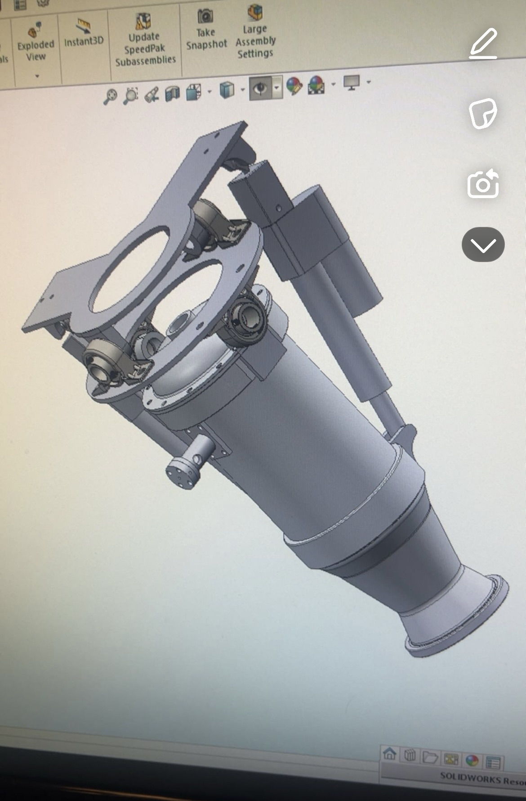
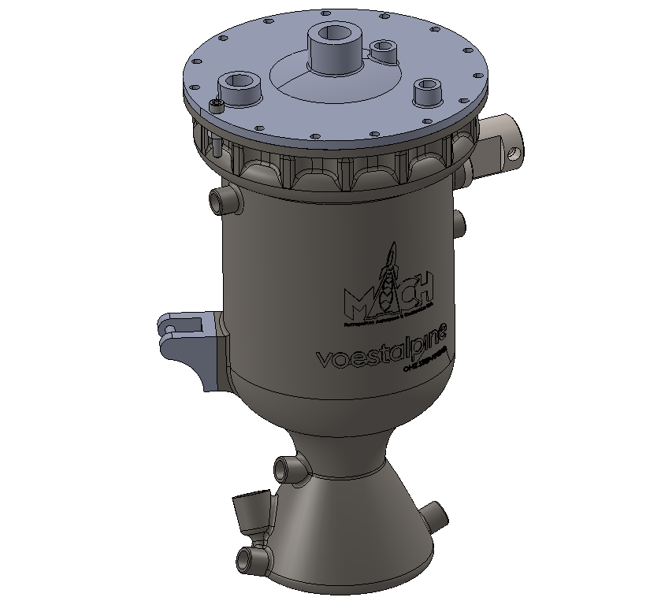
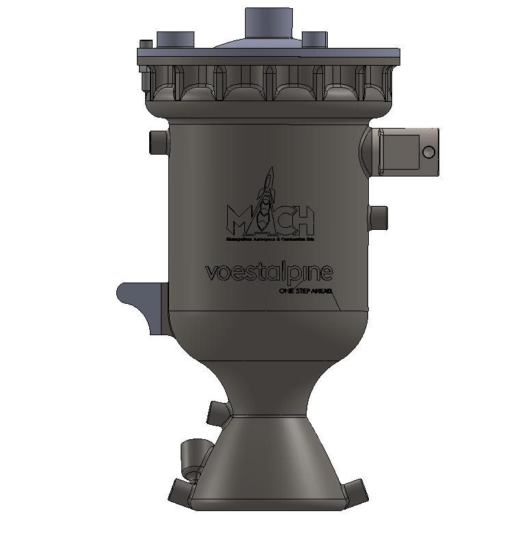

# SABRE

SABRE (Student Additive Bi-propellant Regenerative Engine) is Mach's cutting-edge regeneratively cooled rocket engine, designed for high-performance propulsion. This innovative engine will undergo its first hot fire testing later this year, marking a significant milestone in our development program.

    
    
    

